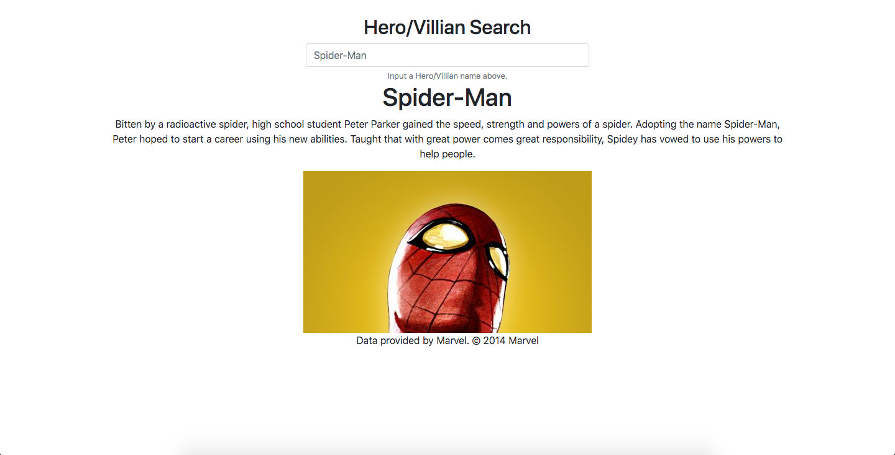

# Marvel_Flask_Website


A simple flask app showing hero/villian data from Marvel's API.

## Dependencies
This project is written in Python 3 so it is **REQUIRED**.
  
  Install dependencies using the command:
  ```
  pip3 install -r requirements.txt
  ```

## Prerequisites
To operate the app you must:

  1. Go to Marvel's developer website and [get API credentials](https://developer.marvel.com/).

  3. Navigate to you're [account dashboard](https://developer.marvel.com/account) and copy the public and private keys.

  4. Place **Public key** and **Private key** in the respective variables found in [config.py](config.py):
      ```
      public_key = "Insert Key Here."
      private_key = "Insert Key Here."
      ```